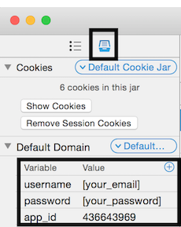

<h3 align="center">
  <a href="https://github.com/KrauseFx/fastlane">
    
     
    fastlane
  </a>
</h3>

  <a href="https://github.com/KrauseFx/deliver">deliver</a> &bull; 
  <a href="https://github.com/KrauseFx/snapshot">snapshot</a> &bull; 
  <a href="https://github.com/KrauseFx/frameit">frameit</a> &bull; 
  <a href="https://github.com/KrauseFx/PEM">PEM</a> &bull; 
  <a href="https://github.com/KrauseFx/sigh">sigh</a> &bull; 
  <a href="https://github.com/KrauseFx/produce">produce</a> &bull; 
  <a href="https://github.com/KrauseFx/cert">cert</a> &bull; 
  <a href="https://github.com/KrauseFx/codes">codes</a>

-------

itc-api-docs
============

###### The unofficial documentation of the iTunes Connect JSON API

# Introduction

This document describes the iTunes Connect JSON API and how to use it. The API is used by the [AngularJS](https://angularjs.org/) based iTunes Connect front-end to update app metadata. It is public once you have a valid session.

To test your requests, I recommend the awesome [Paw](https://luckymarmot.com/paw) HTTP Client for Mac OS.

[fastlane](https://github.com/KrauseFx/fastlane) and some of the fastlane tools make use of the iTunes Connect API. Using this git repository it's easy to keep the documentation up to date.

### Cookies

All requests (except for the login action) require you to pass cookies. If you're using a HTTP client, you'll get this for free. 

# Testing/Using the API

Download the pre-filled [PAW file](https://github.com/fastlane/itc-api-docs/blob/master/assets/iTunesConnectAPI.zip?raw=1) and open it with [Paw](https://luckymarmot.com/paw).

Next, you can enter your iTunes Connect credentials in the `Default Domain` settings: 

**The `app_id` is the ID of your app.** You only need to fill that in, if you want to fetch the metadata for one of your apps.

Switch back to the list of requests on the left side and select `Login`. Click `CMD` + `R` to send the request to login.

# API Docs

## Login

For all requests listed below, you'll need a valid cookie which you have to pass for each request.

**POST**

    https://itunesconnect.apple.com/WebObjects/iTunesConnect.woa/wo/0.0.1.11.3.15.2.1.1.3.1.1

**Available parameters**

- **theAccountName** (POST): Your Apple ID
- **theAccountPW** (POST): Your password

##### [Example response](examples/login.md)

The response HTTP status codes are confusing: 

- `302 Moved Temporarily`: Login successful
- `200 OK`: Login unsucessful, wrong credentials

If you get `200` and your credentials are correct, try deleting the cookies.

## List Apps

List all your apps with the most basic app metadata:

**GET**

    https://itunesconnect.apple.com/WebObjects/iTunesConnect.woa/ra/apps/manageyourapps/summary

##### [Example response](examples/summary.md)

If you get `401`, try deleting the cookies and sending a new login request.

## Fetch App Information

Receive all metadata information available for this app, including app description, screenshots, review status and much more.

**GET**

    https://itunesconnect.apple.com/WebObjects/iTunesConnect.woa/ra/apps/version/[app_id]

**Available parameters**

- **App ID** (GET): The ID of your app (e.g. 903020700)
- **v** (GET): Defines if the app metadata of the version currently available in the App Store or the new version should be used.

**Example:**

    https://itunesconnect.apple.com/WebObjects/iTunesConnect.woa/ra/apps/version/[app_id]?v=live

This will fetch the app metadata from the version, that is currently available in the App Store. If you don't define this parameter, you receive the metadata from the version that is currently being edited.
Usually you don't need this parameter.

##### [Example response](examples/details.md)

## Update App Information

You can update the app metadata using this request. It's not very easy to build the request, as there are many parameters required. 

To upload screenshots it's recommended to use the `iTMSTransporter`, which is also used by [deliver](https://github.com/KrauseFx/deliver).

**POST**

    https://itunesconnect.apple.com/WebObjects/iTunesConnect.woa/ra/apps/version/save/[app_id]

**Available parameters**

[See example POST Request](examples/update_request.md) (quite complex)

##### [Example response](examples/update.md)

## Create a new App Version

Create a new version of your existing app.

**POST**

    https://itunesconnect.apple.com/WebObjects/iTunesConnect.woa/ra/apps/version/create/[app_id]

**Available parameters**

- **App ID** (GET): The ID of your app (e.g. 903020700) *GET*
- **JSON** (POST): `{"version": "2.0"}`

##### [Example response](examples/new_version.md)

## Create a new App

Creates a new app on iTunes Connect

**POST**

    https://itunesconnect.apple.com/WebObjects/iTunesConnect.woa/ra/apps/create/?appType=ios

**Available parameters**

[See example POST Request](examples/create_request.md)

The response HTTP status codes are not correctly used:

- `200 OK`: An error occured, check the response JSON to read the error message
- `200 OK`: Successfully created a new app

You have to read the `response["data"]["sectionErrorKeys"]` to be sure the request was successful.

##### [Example response](examples/create.md)

## Upload a new binary

Uploading a new binary is only possible using the `iTMSTransporter`. You can take a look at [deliver](https://github.com/KrauseFx/deliver) how this is implemented. 

## List uploaded builds

This request will show information about all uploaded builds:

**GET**

    https://itunesconnect.apple.com/WebObjects/iTunesConnect.woa/ra/apps/[app_id]/trains/

##### [Example response](examples/list_builds.md)

## Get/Set build test information 

Based on the list command, you can also get and set information about a certain build, like the release notes, contact email:

**GET/POST**

    https://itunesconnect.apple.com/WebObjects/iTunesConnect.woa/ra/apps/[app_id]/trains/[train]/builds/[build]/testInformation

The `[train]` value is the version number (e.g. `2.0`) while the `[build]` value is the build number.

To set information, use the same URL and provide everything contained inside `data` as a JSON value in the request.

##### [Example response](examples/get_build.md)

## Get Binary details

You can receive more details for a specific build and its binary

**GET**

    https://itunesconnect.apple.com/WebObjects/iTunesConnect.woa/ra/apps/[app_id]/trains/[train]/builds/[build]/details

The `[train]` value is the version number (e.g. `2.0`) while the `[build]` value is the build number.

##### [Example response](examples/binary_details.md)

## Get List of testers of a build

Receive a list of all testers who have access to the given build.

**GET**

    https://itunesconnect.apple.com/WebObjects/iTunesConnect.woa/ra/apps/[app_id]/trains/[train]/builds/[build]/testers

The `[train]` value is the version number (e.g. `2.0`) while the `[build]` value is the build number.

##### [Example response](examples/testers.md)

# fastlane

This documentation is part of the [fastlane](https://fastlane.tools) toolchain. 

##### [Like what we're doing? Be the first to know about updates and new fastlane tools](https://tinyletter.com/krausefx)

# Thanks

Special thanks to [this GitHub Issue](https://github.com/kovpas/itc.cli/issues/38) in particular @spidfire and [Christian Beer](https://twitter.com/christian_beer).
